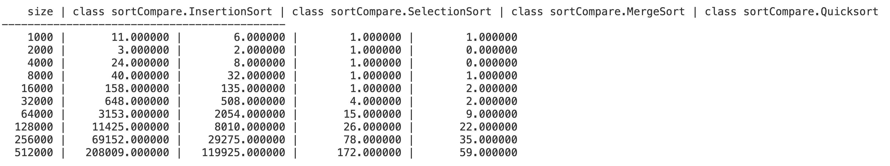
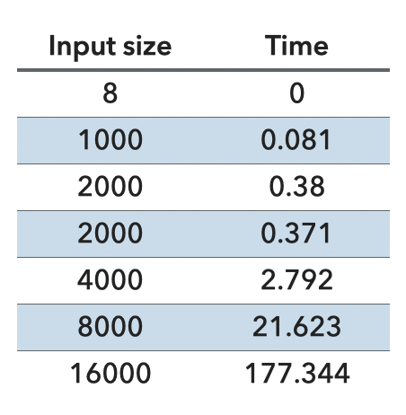
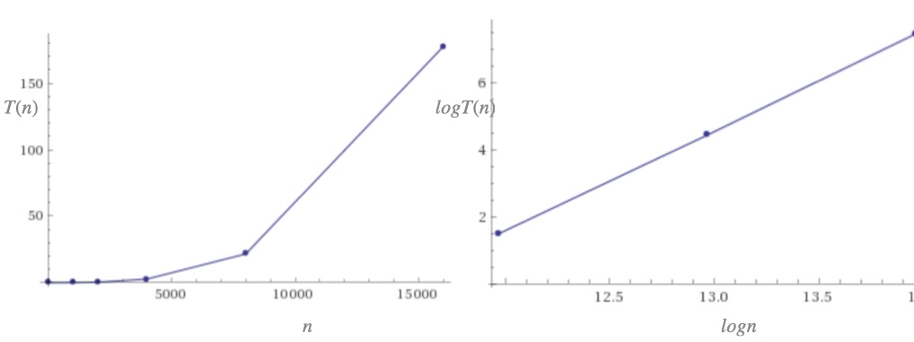
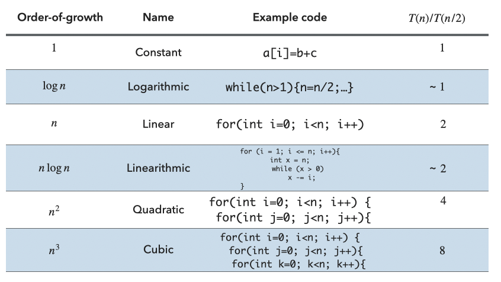

# Lab: Timing Sorting Algorithms

## Objectives

In this lab, we'll be playing with some of the sorting algorithms we've been discussing in class. In particular, we'll be looking at selection sort, insertion sort, quicksort, and mergesort, but we'll also encounter [bubblesort](https://www.youtube.com/watch?v=k4RRi_ntQc8).

This is a pair optional lab. You are encouraged to discuss concepts with your classmates. This lab consists of

1. understanding sorting algorithms from their animations
2. implementing a modified `merge()` of mergesort
3. timing and reasoning about different sorting algorithms

## Getting Started

After you've setup your project, spend some time (at least five minutes) looking at the different classes.

* Look at the interface `Sorter`.
* Look at how the `SelectionSort`, `InsertionSort`, `Quicksort`, and `MergeSort` classes implement the interface.
* Look at how the `main` method of the `SortTimer` class is able to print out data for an arbitrary number of `Sorter` classes. (This is the benefit of using an interface!)
* Notice that the `SortTimer` class does a check for correctness after sorting. If you make a mistake in implementing your `merge` method, you will get an error here.

## Play with the Sorting Algorithms

First, familiarize yourself with bubblesort.

In your code editor, navigate to the `coinSort` package and run the file `CoinSorter.java`. You will see a window with squares filled with coins of different sizes. Use the keystrokes below to shuffle and sort the coins. Experiment with visualizing several of the sorting algorithms (even those that we have not yet covered in class). The yellow coins are the coins being compared and green coins show exchanges between two locations.

| Key | Action                                             |
| --- | -------------------------------------------------- |
| `c` | sort the coins using a randomly-selected algorithm |
| `b` | sort the coins using bubble sort                   |
| `i` | sort the coins using insertion sort                |
| `q` | sort the coins using quicksort                     |
| `h` | sort the coins using heapsort                      |
| `s` | sort the coins using selection sort                |
| `r` | rearrange the coins into a random order            |
| `f` | freeze or step the sorting animation               |
| `t` | thaw/continue the sorting animation                |
| `x` | exit the program                                   |

Typing `f` (for "freeze") stops the sorting; typing `t` (for "thaw") resumes the sorting. Typing `f` when the sorting is frozen advances the algorithm by one step. You can continue to type `f` to proceed step-by-step, or `t` to resume normal execution.

Practice with the `c` command to develop your skill in identifying the algorithm from the pattern of comparisons and swaps. Can you consistently guess which sorting algorithm is being run based on observing the animation? Talk with the people next to you. When you feel familiar with all of the sorting algorithm animations and you've guessed 3 of them correctly in a row, feel free to move on to the next step.

## Finish `MergeSort`

You've been given all of the code for this lab except the `merge` method, which you should now implement based on the "`TODO`" suggestions. Please note that this is a slight variation of the merge method we discuss in class. Give it a good effort, but if you get stuck, ask an instructor for help. Remember, we use the `set` and `get` methods to set/get data given an index in an `ArrayList`.

Once this is done, you should be able to run the `SortTimer` class.

## Play with the Timing

Run the `SortTimer` class. It will print out a table:



Recall the doubling hypothesis. For a lot of the programs we write, we can formulate a hypothesis for the following question:

> What is the effect on the running time of doubling the size of the input?

One simple way to develop a doubling hypothesis is to pass an input of double the size to our code and observe the effect on the running time. For example, let's say we are asked to write a program that given an array of $n$ integers, returns how many triplets sum to 0 and have developed the following brute-force method:

```java
public static int count(int[] a) {
   int n = a.length;
   int count = 0;
   for (int i = 0; i < n; i++) {
      for (int j = i+1; j < n; j++) {
         for (int k = j+1; k < n; k++) {
            if (a[i] + a[j] + a[k] == 0) {
               count++;
            }
         }
      }
   }
   return count;
}
```

We know conceptually that this code runs in $O(n^3)$ since we see three nested for loops, but how about experimentally? To test, we can call this method on an array of $n$ random integers and time how long it took to get back an answer. We can start with the $n$ being small, e.g., just 8 numbers, but we should also try it with bigger problem sizes, e.g., on an array of 1000, or twice as big (2000), or twice as big again (4000), etc. As we do that again and again, we note down how much time it took for our program and we end up with a table like this:



We notice that as the input size of the array becomes bigger, our program takes more time to run. And that even on an array of the same size (i.e. 2000 random integers), there will be slight variations in the running time.

You might also notice that the elapsed time increases approximately by 8 each time we double the size, that is

$$
\frac{T(n)}{T(n/2)} = 8
$$

We might also plot the running times on a standard plot (left) or log–log plot (right) of input size (x axis) to running time (y axis).



The log–log plot will often be a straight line with a certain slope. For example, here the slope is 3, which suggests the hypothesis that the running time satisfies a power law of the form of $cn^3$, where $c$ is some constant that we generally ignore.

Knowing that the order of growth is $~n^3$ tells us to expect the running time to increase by a factor of $8=2^3$ when we double the size of the problem. This is known as a cubic order of growth, or $O(n^3)$.

In general, when you want to experimentally understand the running time of your code, you can follow the process above by timing your code on increasingly bigger problem sizes that you double every time. If you see consistently that for those bigger sizes, $\frac{T(n)}{T(n/2)}$ stays approximately the same, then you can consult the following table of common orders of growth.



Now it's time to interpret your table of different sorting times.

What explains the different answers obtained for small values (<10,000) of size? Notice that we have called the `printTimes` method twice in the `SortTimer` object in main. Does the data obtained from the second run look like you would expect? Which one is faster and why?

Inside the `printTimes` method, we generate random data for the initial `ArrayList` to sort. Look at the `TODO`s here and see if you can figure out how to set up the experiment to accurately compare the sorting algorithms with random data. What is wrong about the current method? How can you fix it? (Ask a TA/instructor if you need help on this.)

The data generated should give you some confidence that `Quicksort`'s average case works as we expect. As an additional test, change the `printTimes` method to generate already pre-sorted data instead of random data. For example, have it fill the array with numbers from 1 to `size`. How does this change your timing data, especially for `Quicksort` and `InsertionSort`? Is this what you expected?

## Grading

You will be graded based on the following criteria:

| Criterion                                                      | Points |
| :------------------------------------------------------------- | :----- |
| Correct merge code & fixed TODOs in SortTimer                  | 1      |
| This week's [exit ticket](https://forms.gle/Px8EBbcL9gQYvG3b9) | 1      |
| Good answers.txt                                               | 1      |
| **Total**                                                      | **3**  |

## Submission

Submit your code on Gradescope. In an `answers.txt`, answer (feel free to discuss with your classmates):

1. The questions we asked in the write-up above: What explains the different answers obtained for small values of size? Does the data obtained from the second run look like you would expect? Which one is faster and why?
2. For each of the sorts (selection, insertion, merge, and quick) what is the runtime and why? How can you deduce this from your data? (Remember the doubling hypothesis!)
3. Repeat the experiment 5-10 times and notice the values. What is the range of the values you get for each sorting size (1000, 2000, 4000, ...512000)? What do these ranges tell you about the reliability of the results? Note that running selection/insertion sort at 256000-512000 might be very slow; feel free to remove them from this experiment and focus mainly on merge/quicksort.
